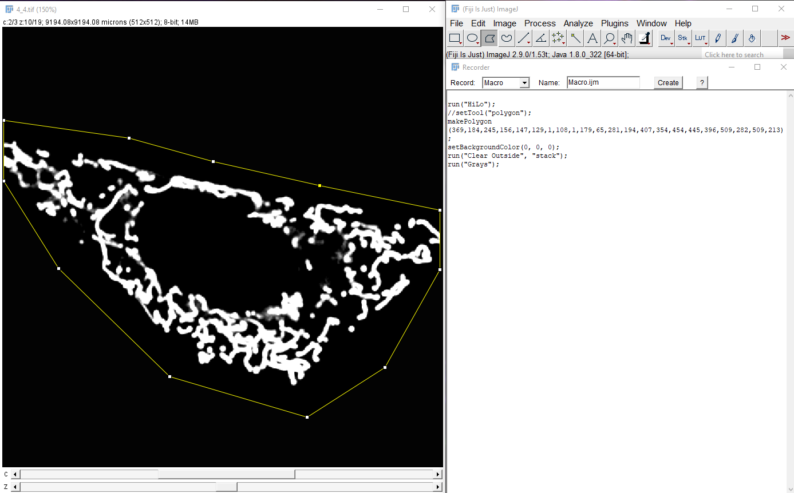
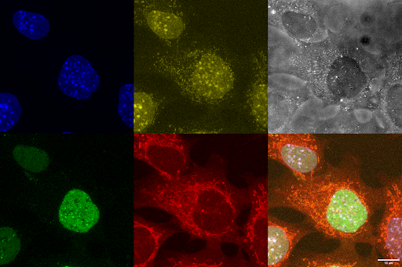

# ImageJ Macro Workshop Level 1

Important resources:
- ImageJ website for plugins: https://imagej.net/ij/
- Advice for macro writing: https://imagej.net/ij/developer/macro/macros.html
- **Built-in Macro function**: https://imagej.net/ij/developer/macro/functions.html

You can download the test microscopic :microscope: images, from the following link: https://github.com/leclercsimon74/ImageJ-Macro-Workshop-Level-1/tree/main

The macro can also be found in the same folder. It will be permanently available even after the workshop.

# Objectives of the workshop
Automatise as much as possible simple tasks, such as running a plugin on all images in a folder, waiting for the user input, chained image manipulation, and conditional image manipulation….

# Condition to come to the workshop
- Laptop :thinking:!
- Have ImageJ or [Fiji](https://fiji.sc/) version 1.53t or later installed on your computer (Help=>Update)
- Read the [ImageJ macro language](https://imagej.net/ij/developer/macro/macros.html)
- Have an interest in automatizing your image analysis pipeline

> [!NOTE]
> We will detail the basic bloc of programming, so it is not needed to have in-depth knowledge!

# Macro 1: Manual crop
You have a lot of 3d images with one cell in the middle and need to clear out any other partial cell that happens to be in the same field of view.
The workflow is the following:
- Open the image
- Select Hilo LUT to see any contaminating signal in any channel of the image
- **Select the cell if needed with square or other selection tools**
- Clear outside the selection
- Optionally, select another LUT
- Save the result, erasing the previous image
- Close the image

Now, except for the **bold** line that requires human intervention, everything else can be done with a Macro.

First is to open a new macro: ‘Plugins’ => ’New’ => ‘Macro’. Be sure to check that the language is ImageJ Macro in the tab ‘Language’. Pushing the ‘Run’ button, located at the bottom, will execute the Macro.

Nearly all functions in ImageJ can be found with the ‘record’, found in ‘Plugins’ => ‘Macros’ => ‘Record’.
ImageJ will start to record nearly all actions that you are doing, like applying a different LUT to an image. The easiest way is then to open an image and do what we want the Macro to do (image 1). The double slash ‘//’ indicates a comment, very useful for indicating what a piece of code is doing.



We can see :eye: a couple of trouble here.
The first one is this makePolygon. We want that to be manually done by the user.
Then we need the program to know the amount of images, their location, their names…
Harcoding, a.k.a. entering in a list/array all this information by yourself is not a solution. But ImageJ has you covered, with the two most important functions needed:
dir = getDirectory()
list = getFileList(dir)
You can find more information on them at [Built-in Macro Functions](https://imagej.net/ij/developer/macro/functions.html).
The first create a dialog window for the user to select the directory, call ‘dir’ here. This is in reality, a string/text.
The second will list all files in the directory that have been selected and will contain a list of file names. A list, or array in ImageJ, is a specific data structure that has an extra function on it.
After that, we need to create a loop to pass through all the items in the list. A for loop is perfect in this scenario:
```
for (i=0; i<list.length; i++){
//code here
}
```
The first element is the starting point, the initialization. As in a lot of programming languages, it starts at 0.
The second element is the ending point. In our case, we went it to continue until it reached the end of the length of the list. The list is the parameter that is returned by getFileDir(dir), and the .length means how many items are there in it. The loop will repeat the code included in the bracket {}.
The last parameter is the iteration step. In this case, ++ means +=1, or increments by 1 at every step.

We then want to open the image. If the image is in a native imageJ format (png, jpg, tif…), the open() does the job very well. Otherwise, we need to use BioFormat (at a later stage though!).
Finally, back to the first trouble, the creation of the polygon. Since we want the user to select it, we need to pause the macro. ImageJ provides a very useful set of functions for this, the easiest to use being ‘WaitForUser()’, which creates a small window. When the user clicks on the OK button, the macro will proceed to the next piece of code. If the user clicks on the x button, the macro will abort.

Then the macro can proceed forward like in the macro record part:
```
run("Clear Outside", "stack");
run("Grays");
run("Save");
run("Close");
```
> [!WARNING]
> You may run into trouble though. What if the user did not select anything? The Macro will run into an error since it cannot ‘Clear Outside’ without an active selection.

There are two ways to solve this trouble, if nothing is selected:
- Make a select all
- Skip the ‘Clear Outside’

The keyword :key: here is **IF**, allowing the macro to check a condition. If the condition is true, the macro will execute the code in the bracket {}. Otherwise, it does not execute this code and instead will execute the code in the else {} bracket if provided.
So we need to detect if there is an active selection, and again, ImageJ provides a function for that, called selectionType, that returns a numerical value based on the type of selection (square, round, polygon…). When there is no selection, it will return the value -1. There are multiple way to test an element:
- == is equal
- != is different, or unequal
- '>', >=, <, <= bigger, smaller than
- &, ^, | are more advanced and, or, nor, generally used to check multiple conditions at the same time

So we can do:
```
if(selectionType != -1){//do something}
```
We have now all the pieces to write our first simple macro!
You can find some test images to try this macro, just be sure to duplicate them since the macro will save on top of the existing images. The Live cell mitochondria are perfect to demonstrate this macro.
> [!TIP]
> The macro answer is called: 1. HiLo_crop.ijm


# Macro 2. Create a max projection composite
Using a similar approach, make a montage image of the IF images in the folder by Macro:
- Set channel 1 to Blue :large_blue_circle: and auto-adjust the brightness and contrast
- Do the same thing for all other channels, with the LUT in order of yellow :yellow_circle:, gray :white_circle:, green :green_circle:, and red :red_circle:
- Make a z-maximum projection
- Make a composite image without the gray (visible channel)
- Add scale bar to the image (10 um)
- Concatenate the maximum projection and the composite image
- Make the montage
- Save the montage as .png with the same name as the original image, the same location

See :eye: an example image below.



The challenge is that the macro recorder does not record your direct action, such as changing the channel or z plane. There is some that it does record if you pass through the menu, but one way is to search (Ctrl+F is your friend) in [Built-in Macro Functions](https://imagej.net/ij/developer/macro/functions.html).
> [!TIP]
> Changing channel is in Stack.

Fusing images is at best annoying. The keyword here is concatenated, and it is located in ‘Stack’=>’Tools’.
> [!IMPORTANT]
> First do it manually with the recorder on, then modify Macro 1 accordingly! Test the Macro on the IF mitochondria for Macro 2.

> [!TIP]
> The macro answer is called: 2.LUT_correction_5.ijm 

# Macro 3. Let’s make it recursive!
Here, we will dive :diving_mask: a little deeper into the programming world.
But before, what does it mean, recursive? Here, we want to run the macro on all images in a folder, even if there are images in a folder of this folder. Right now, macro 2 will process only the first 2 images but will throw an error when trying to open the folder ‘Condition 1’ (for IF mitochondria for Macro 3). In addition, it will also open all files that it can open, even the ‘.png’ that it just creates, leading to some undesirable bugs.
To do such a feast, we need functions. A function is a piece of code that you can call again and again, like in the for loop. When we call getFileList, we call a function from ImageJ. Here, we need to make at least two functions:
- a function that will list the files in a directory
- a function that will process the image as we want

To create a function, we just need a keyword :key:: ‘function functionname(functionparameters){}’.
The first function is a loop, like in macros 1 and 2. However, we detect if the item that we are trying to open is an image or another directory. If the item is of extension ‘.tif’, we know that it is an image that we can process, if the item finishes with a slash ‘/’, we know this is a folder. In the first case, we can just call the function to open and process the image. In the second case, we can call again the first function, to list all files in the new folder. And continue until there is no folder or images to process.

It is a difficult process to grasp, so here is the code for the first function:
```
function listFile(dir){
  list = getFileList(dir);
  for (i=0; i<list.length; i++){
    if (endsWith(list[i], "/")) //folder
      listFiles(""+dir+list[i]);
    if (endsWith(list[i], ".tif")) //tif image
      processImage(dir+list[i]);
  }
}
```
This works as follows:
- grab the list of item
- iterate through each item
- if the item ends with a slash, it is a folder
  - call again the function, but this time on the sub-folder (dir+list[i])
- if the item ends with a tif format, process the image as in the previous macro

Make the code for the function processImage(path), with the content being identical to Macro 2.
For this macro to start, we need a directory, with getDirectory, then initialize the first iteration of listFiles with listFiles(dir).

# Macro 4. Saving elsewhere and dialog option
So far, we always saved the image in the same folder as the original image. If this is not the desired outcome, it is possible to create a new folder or saving elsewhere completely. It is also sometimes needed to pretreat some images and not others. As such having a dialog option is critical.

The simplest solution to save elsewhere is to ask the user for a result directory with getDirectory(). It is then possible to clone the arborescence :deciduous_tree: with a recursive macro (out of scope for level 1, though).
In the [Built-in Macro Functions](https://imagej.net/ij/developer/macro/functions.html), there is a File function that allows manipulation of folders, such as creation.
Another nice option is to create a dialog window. This is easily done in ImageJ with the Dialog class, which allows to creation of and reading of the dialog options and creates some choices/branching based on the user input.

Macro 4.Square_selection.ijm demonstrates both options, better to try on the Macro 4 folder (very simple nuclear images):
- it first asks where to save the images, then the directory to process
- it opens only the images that are tif. No recursive option here.
- it opens the image, grabs the image name, renames it, and prints where the image will be saved and under which name
- It then creates a dialog option, with the option to pass/skip the image as a checkbox
  -The user needs to make a rectangle selection around the cell of interest
- if it is not skipped and the selection is a rectangle:
  - grab the center of the rectangle position, and make it square
  - Duplicate the square
  - Resize it to 100x100 pixels
  - Save as tiff
  - Close all images
- otherwise, close the image

> [!TIP]
> Dialog is very powerful but tends to get very ugly quickly when there are too many options.

Text, also named string, can be manipulated very easily. Concatanate them with ‘+’.
Similarly, ImageJ uses a lot of text as function parameters. The most used one is the run() function, which takes two parameters. The first one is the function itself, such as “Duplicate…”, the second parameter is some text containing parameters needed for this function. It is possible to modify these parameters with string manipulation, like in the example:
```
run("Duplicate...", "duplicate channels="+channel+" slices="+slice);
```
Where the value from the channel and slice has been retrieved with the getPosition function.

# Conclusion
With these tools, you should be able to pre-process and visualize folders of images. The combination of the Macro recorder and [Built-in Macro Functions](https://imagej.net/ij/developer/macro/functions.html) should let you free to experiment with your images. This is the only way to learn!

The next workshop, level 2, will focus on how to extract data from images, using both the Measure tools, the Analyze particles, and the famous ROI Manager, and saving these data to a CSV file.

